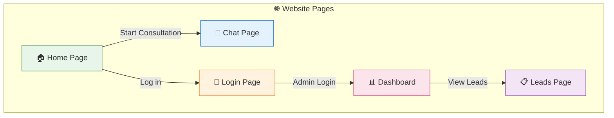
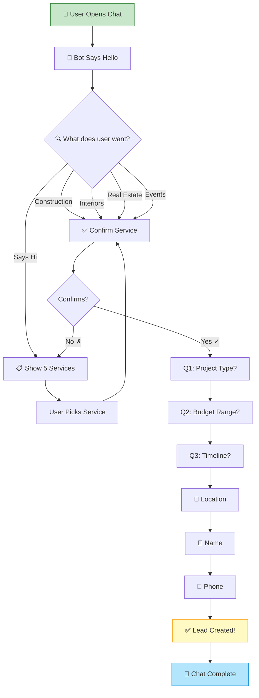
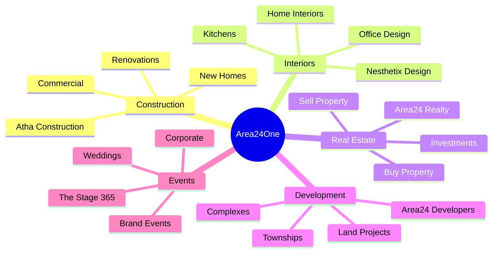
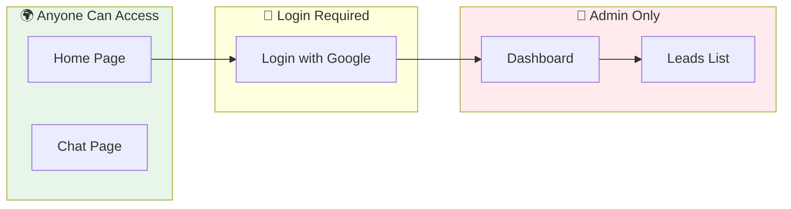
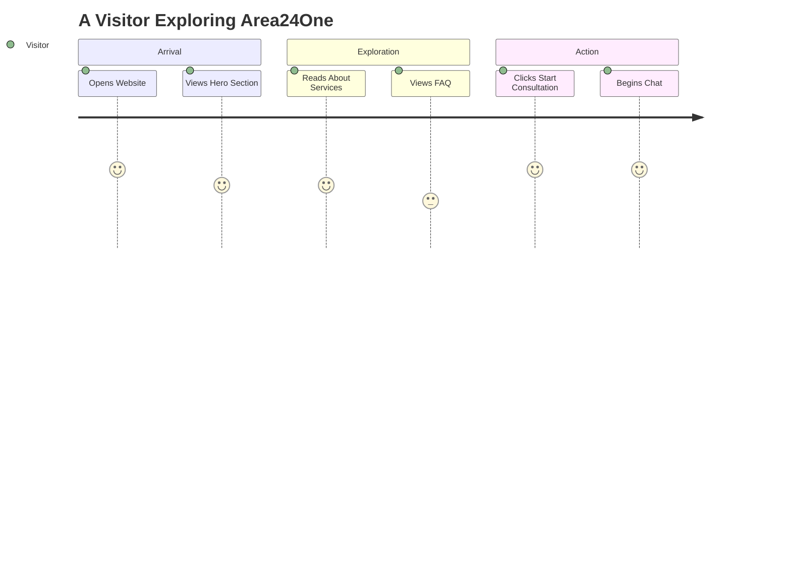

# How to Export Diagrams from the User Flow Guide

## 🎯 Quick Method: Use Mermaid Live Editor (2 minutes each)

### Step 1: Open Mermaid Live Editor
Go to: **https://mermaid.live**

### Step 2: Copy & Paste Each Diagram Code

---

## 📊 DIAGRAM 1: Website Flow

Copy this code and paste into the editor:

---

## 📊 DIAGRAM 2: Chat Conversation Flow

---

## 📊 DIAGRAM 3: The 5 Service Brands

---

## 📊 DIAGRAM 4: Login & Admin Flow

---

## 📊 DIAGRAM 5: User Journey

---

## Step 3: Download Each Diagram

1. After pasting the code, the diagram will appear on the RIGHT side
2. Click the **"Actions"** button (or download icon) in the toolbar
3. Select **"PNG"** or **"SVG"** format
4. Save to your computer
5. Insert into your Word document

---

## 🎨 Alternative: Use VS Code Preview

If you have VS Code installed:
1. Open the `user_flow_guide.md` file
2. Install the "Markdown Preview Mermaid Support" extension
3. Press `Ctrl + Shift + V` to preview
4. Right-click diagrams to save as images

---

## 📁 Files Created

| File | Location |
|------|----------|
| Word Document | `C:\Jerry\Workspace\Area24one\Area24One_User_Flow_Guide.docx` |
| This Guide | `C:\Jerry\Workspace\Area24one\diagram_export_guide.md` |
